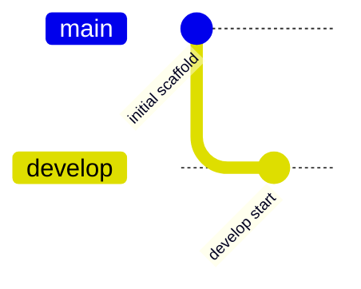

<div align="center">

# 🗺️ API Map

**카카오·네이버 평점을 한 지도에서 — 음식점·카페 평점 지도**

</div>

## 설명

카카오맵 JS SDK로 현재 화면 영역의 음식점·카페를 실시간 검색해 표시하고, 사전 수집한 카카오/네이버 평점 캐시(`data/ratings.json`)를 장소별로 병기하는 개인용 지도입니다. GitHub Pages로 정적 배포됩니다.

## 기술 스택

<p>
  
  
  
  
  
  
  
</p>

## 주요 기능

- **실시간 뷰포트 검색**: 지도를 움직이면 현재 영역의 음식점(FD6)·카페(CE7)를 즉시 표시 (카카오 공식 SDK)
- **평점 병기**: 마커 클릭 시 카카오 ★평점(참여 수)과 네이버 ★평점/방문자·블로그 리뷰 수를 함께 표시
- **평점 라벨**: 캐시에 평점이 있는 장소는 마커 위에 `K 4.2 · N 4.5` 라벨 표시
- **필터**: 음식점/카페 토글, 카카오 최소 평점(3.5+/4.0+/4.5+) 필터
- **딥링크**: 카카오맵/네이버지도 상세 페이지로 바로 이동
- **평점 수집기**: `collector/collect.py`(카카오), `collector/naver_match.py`(네이버, Playwright)

## 설치 및 실행

### 1. 카카오 JavaScript 키 설정

1. [Kakao Developers](https://developers.kakao.com)에서 앱 생성
2. 앱 설정 > 플랫폼 > Web에 `http://localhost:8000`, `https://tjdckscert.github.io` 등록
3. `js/config.js`의 `KAKAO_JS_KEY`에 JavaScript 키 입력

### 2. 로컬 실행

```bash
python -m http.server 8000
# → http://localhost:8000
```

### 3. 평점 수집 (로컬에서 실행)

```bash
# 카카오 평점 수집 (지역·키워드별)
python collector/collect.py "강남역 카페" "강남역 음식점" --pages 5

# 네이버 평점 매칭 (실험적 — Playwright 필요)
pip install playwright && playwright install chromium
python collector/naver_match.py --limit 30
```

수집 후 `data/ratings.json`을 커밋/푸시하면 Actions가 Pages에 자동 배포합니다.

> ⚠️ 평점 수집은 비공식 엔드포인트를 사용하는 개인용 기능입니다. 저속(요청 간 대기)으로만 실행하고, 데이터의 외부 서비스 제공에는 사용하지 마세요.

## Git Flow



## 프로젝트 구조

```
API Map/
├── index.html              # 지도 페이지
├── css/style.css           # 스타일
├── js/
│   ├── config.js           # 카카오 JS 키 설정
│   └── app.js              # 지도 + 실시간 검색 + 평점 매칭
├── data/ratings.json       # 평점 캐시 (수집기로 갱신)
├── collector/
│   ├── collect.py          # 카카오 장소+평점 수집기
│   └── naver_match.py      # 네이버 평점 매칭 (실험적)
└── .github/workflows/deploy.yml  # Pages 자동 배포
```
