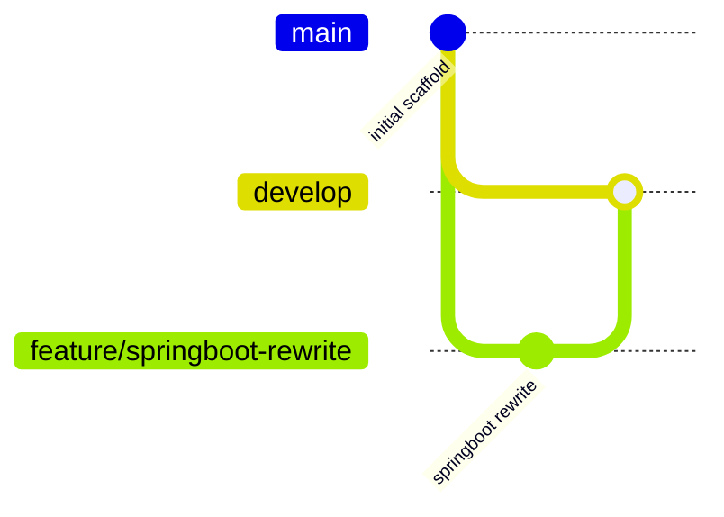

<div align="center">

# 🗺️ API Map

**카카오·네이버 평점을 한 지도에서 — 음식점·카페 평점 지도**

</div>

## 설명

지도를 움직이면 Spring Boot 백엔드가 지도 중심의 행정동을 알아내고(OSM Nominatim 역지오코딩), 카카오맵 검색을 프록시해 해당 지역 음식점·카페를 **카카오 평점과 함께 실시간**으로 표시합니다. 네이버 평점은 오프라인 수집분(`data/ratings.json`)을 병합해 함께 보여줍니다. 프론트는 Leaflet 기반이라 **API 키 없이 바로 실행**됩니다.

## 기술 스택

<p>
  
  
  
  
  
  
  
</p>

## 주요 기능

- **실시간 뷰포트 검색**: 지도 이동 시 백엔드가 `행정동 + 카페/음식점` 검색을 프록시해 평점 포함 결과 반환
- **평점 병기**: 마커 라벨에 `K 4.2 · N 4.5`, 팝업에 카카오 ★평점(참여수·리뷰수)과 네이버 평점/방문자리뷰 표시
- **필터**: 음식점/카페 토글, 카카오 최소 평점(3.5+/4.0+/4.5+) 필터
- **딥링크**: 카카오맵/네이버지도 상세 페이지 바로가기
- **캐싱**: 역지오코딩 24시간, 검색 결과 10분 메모리 캐시 (상위 서비스 부하 최소화)
- **네이버 수집기**: `collector/naver_match.py` (Playwright, 좌표 검증 매칭, 차단 감지 시 자동 중단)

## 설치 및 실행

JDK 21 필요 (Eclipse Adoptium 권장).

```bash
# Windows
run.bat

# 또는 직접
./gradlew bootRun
```

→ http://localhost:8890 접속. API 키 설정 없이 바로 동작합니다.

### 네이버 평점 수집 (선택)

```bash
# 1) 수집 대상 시딩 (카카오 장소 목록을 data/ratings.json에 저장)
python collector/collect.py "강남역 카페" "강남역 음식점" --pages 4

# 2) 네이버 평점 매칭 (Playwright 실브라우저, 저속)
pip install playwright && playwright install chromium
python collector/naver_match.py --limit 30
```

수집 후 서버를 재시작하면 네이버 평점이 지도에 함께 표시됩니다.

> ⚠️ 평점 조회는 비공식 엔드포인트를 경유하는 개인용 기능입니다. 캐싱을 켠 채 저속으로만 사용하고, 외부 공개 서비스에는 사용하지 마세요.

## API

| 엔드포인트 | 설명 |
|---|---|
| `GET /api/places?lat=37.498&lng=127.028&categories=food,cafe` | 좌표 주변 음식점/카페 + 평점 |

## Git Flow



## 프로젝트 구조

```
API Map/
├── src/main/java/com/apimap/
│   ├── ApimapApplication.java
│   └── place/
│       ├── PlaceController.java   # GET /api/places
│       ├── PlaceService.java      # 역지오코딩 + 카카오 검색 프록시 + 캐시
│       ├── NaverStore.java        # 네이버 평점 캐시(data/ratings.json) 로더
│       └── Place.java
├── src/main/resources/
│   ├── static/                    # Leaflet 프론트엔드
│   └── application.yml            # 포트 8890
├── collector/
│   ├── collect.py                 # 카카오 장소 시딩
│   └── naver_match.py             # 네이버 평점 매칭 (실험적)
├── data/ratings.json              # 네이버 평점 수집분
├── run.bat                        # Windows 실행 스크립트
└── .github/workflows/ci.yml       # Gradle 빌드 CI
```
